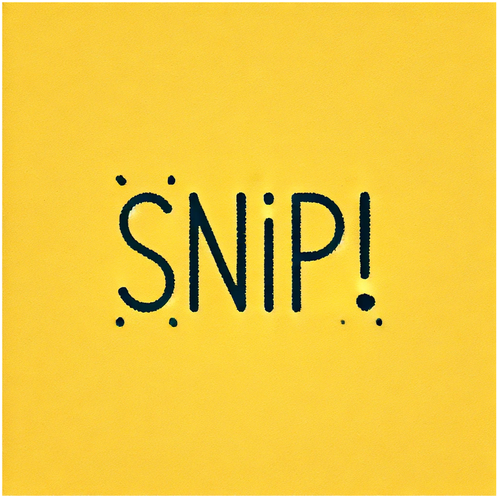
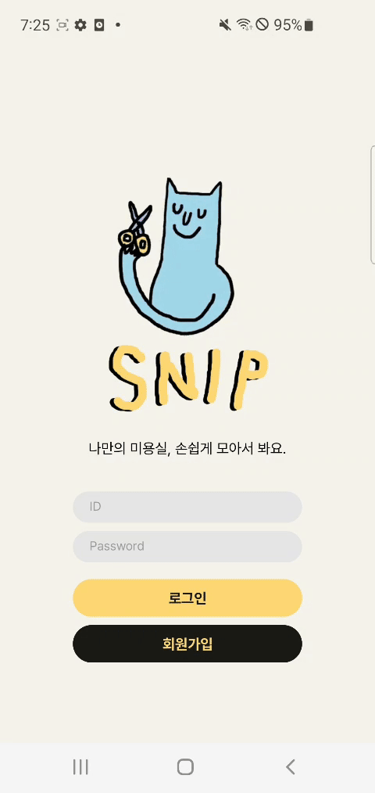
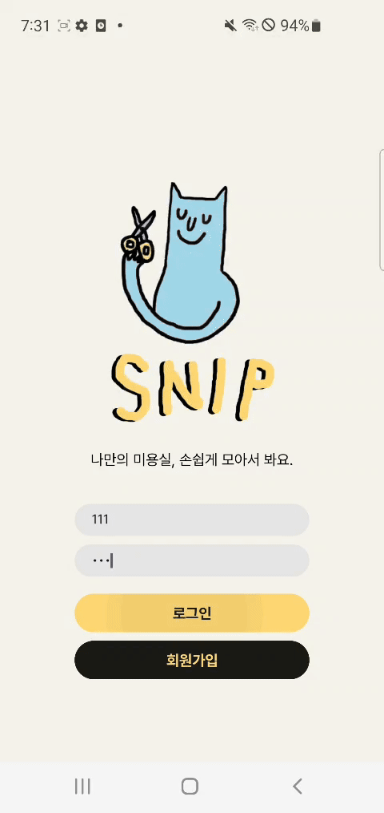
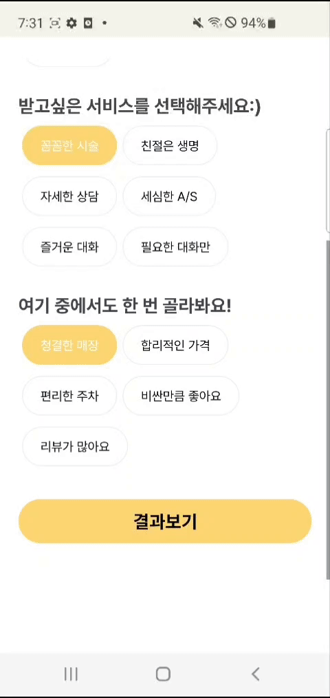
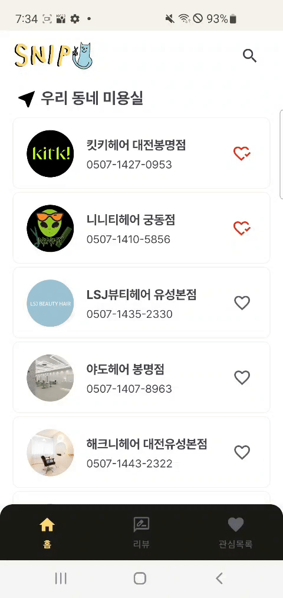

# **SNIP**

가까운 미용실을 손쉽게 찾고, 

솔직한 리뷰와 사진으로 공유하세요. 

당신만의 특별한 뷰티 공간을 이웃들과 

함께 만들어가는 경험!

---

### 이승재

- 부산대학교 정보컴퓨터공학부
- leesj6717@gmail.com
- Github [@](https://github.com/callasio)Ea3124

[Ea3124 - Overview](https://github.com/Ea3124)

### 이현서

- 고려대학교 컴퓨터학과
- hyunseo4242@gmail.com
- Github [@](https://github.com/Jeeyoon038)ss-leg-al

[ss-leg-al - Overview](https://github.com/ss-leg-al)

---

# Introduction

<aside>

### ✂️ 가까운 미용실을 손쉽게 찾고,솔직한 리뷰와 사진으로 공유하세요!

</aside>

# Login /  Sign Up

<aside>

### ✂️  간편하게 회원가입하고 로그인하세요

</aside>

### **처음 화면**

🔸 앱 실행시, 기본화면에 로그인 입력창 및 

로그인/회원가입 버튼 표시

🔹`InfoActivity` 로 기본 화면 로드

🔹`Room Database` 로드와 동시에 회원가입을 

위한  `AppDatabase`, `User` 생성 

---

### 회원가입

🔸 회원가입 버튼 클릭시, 팝업으로

회원가입 창 표시

🔸 영상과 같이 닉네임, ID, Password 및 

확인 입력란 확인 가능

🔸 ID중복, Password 불일치시 회원가입 실패

🔹생성된 DB에 `nickName`, `id`, `password`, \

`loginCount`가 작성되어 User 추가

🔹생성 완료 시 `Toast`로 메세지를 띄운다

---

### 로그인

🔸 ID와 password를 입력하여 로그인 시도

🔸 저장된 ID나 Password가 아닐시 

메인 페이지 접근 불가

🔹 생성된 DB내에서 `User` 정보와 일치시 

`MainActivity` 접근 가능

<aside>

### ✂️  처음 가입하는 당신을 위해 미용실을 추천해드려요

</aside>

### **관심사 설정**

🔸 첫 로그인시, 초기 화면에 "00님, 반가워요”

탭 2초간 유지 후 사라짐

🔸 다양한 필터 유형(성별, 스타일, 서비스)을

제공하며, 사용자 선택 시 동적으로 화면을

업데이트

🔸 성별은 다중 선택 불가, 나머지는 가능

🔹 `Intent`를 통해 `User`내의 `NickName`받아

와서 사용

🔹 필터 선택 시`FilterOptionsRVAdapter`를 

통해 선택된 필터 옵션을 관리하고 화면을 

업데이트

🔹 각 필터 옵션은 `FilterOption` 클래스로 

정의되며, 이를 기반으로 사용자의 선택을 처리

---

### 결과 표시

🔸 "결과보기" 클릭시 선택된 필터에 따라 결과를 

로딩 후 표시

🔸 즐겨찾기 설정 후 "메인화면으로 가기" 클릭시 

홈 화면으로 전환

🔹 선택된 필터 옵션을 기반으`List<HairShop>` 

를 필터링하고 화면에 표시.

🔹 결과를 표시하기 전에 `Framelayout` 내 

로딩 레이아웃을 표시, 로딩 후 결과를 동적으로 

업데이트

🔹 결과를 표시하기 전에 `Framelayout` 내 

로딩 레이아웃을 표시, 로딩 후 결과를  동적으로

업데이트

---

# TAB 1

<aside>

### ✂️  미용실을 검색하고 관심 미용실을 등록해봐요

</aside>

### 홈 화면

🔸 앱의 홈 화면에서 미용실 리스트와 

검색 기능 제공

🔹 `HomeFragment`를 사용하여 홈 화면 로드

🔹 `RecyclerView`를 사용하여 미용실 리스트를 

동적으로 표시

---

### 미용실 불러오기

🔸 미용실 데이터를 관리하고 RecyclerView에 

바인딩

🔹 `HairShopAdapter`를 사용하여 미용실 정보를 

표시하며, 필터 기능을 통해 검색 결과를 제공.

🔹 사용자의 '즐겨찾기' 상태에 따라 하트 아이콘을 

업데이트하고, `SharedPreferences`를 사용하

여 상태를 지속적으로 관리

---

### 검색 기능

🔸 상단의 SearchView를 통해 미용실을 검색 가능

🔹 검색어에 따라 미용실 리스트를 필터링하고 결과

결과를 동적으로 업데이트하여 화면에 표시

<aside>

### ✂️ 단 한번의 손짓으로 전화를 걸어요

</aside>

### 밀어서 전화하기

🔸 사용자가 항목을 오른쪽으로 스와이프할 때  

전화 걸기 기능이 활성화

🔸 절반 이하로 스와이프시 다시 되돌아게된다.

🔸 스와이프

🔹 `ItemTouchHelper`를 사용하여 스와이프

동작을 구현하고, 전화 걸기 기능을 제공

🔹 스와이프 시 시각적 유연함을 위해 그라데이션 

배경과 아이콘을 표시

---

# Tab 2

<aside>

### ✂️  SNIP 만의 생생한 리뷰를 확인하고 작성하세요!

</aside>

### 리뷰 갤러리

🔸 사진, 별점, 미용실 이름과 함께

      리뷰 미리보기를 지그재그로 표시

🔸 리뷰 클릭 시 전체 내용이 모달 창에 표시

🔹`Glide` 로 이미지 로드

🔹`RecyclerView` 로 갤러리 리스트 표시

---

### 사진과 함께 리뷰 추가

🔸 나의 갤러리에 있는 사진 업로드 후

      미용실, 별점을 선택하여 리뷰 작성

🔸 작성한 리뷰가  최신순으로 갤러리 상단에 노출

🔹`RecyclerView` + `Adapter`   패턴으로  

동적 리스트 관리

---

### 사진 수정 및 삭제

🔸 수정 버튼 클릭 시 기존 내용이 쓰인

리뷰 수정 모달 창 표시, 입력 후 갤러리 업데이트

🔸 삭제 버튼 클릭 시 갤러리에서 해당 리뷰 삭제

🔹`isEditing` 함수를 작성하여 리뷰 작성과 수정     

에서 동일한 모달 창 `Fragment` 재사용

---

# Tab 3

<aside>

### ✂️  나의 관심 미용실을 지도에서 직접 확인하세요!

</aside>

### 관심목록

🔸 앱의 즐겨찾기 화면에서 사용자가 즐겨찾는 미용

실 목록을 관리

🔸 즐겨찾기한 미용실을 가로로 스와이프 할 수 있게 

배치

🔹 `FavoriteShopAdapter`를 사용하여 즐겨찾기

된 미용실만 목록에 표시

---

### 지도상에서 위치 확인하기

🔸 앱의 알림 화면에서 사용자는 즐겨찾는 미용실의 

위치를 지도상에서 확인 가능

🔹 `NotificationsFragment`를 사용하여 알림 

화면을 로드하고, `Google Maps`를 통해 미용실

위치를 표시

🔹 즐겨찾기된 미용실의 위치에 마커를 추가하고,

해당 미용실을 클릭하면 지도에서 위치를

확인할 수 있습니다.

🔹 마커에 각 미용실의 좌표와 이름을 추가하여 사용

자가 쉽게 식별할 수 있게 표시

# 후기

### 이승재

 첫 일주일은 어떻게 지나갔는지 모를정도로 빠르게 흘러갔었다. 그런만큼 이 앱에서 아쉬운 부분들도 분명히 있었지만, 일주일 전보다는 조금 더 성장함을 느끼고 있다. 

 특히 AndroidStudio가 기존 웹 개발 Tool과는 달라 많은 어려움이 있었지만, 그래도 오류 해결시에 다양한 곳에서 오류를 확인 할 수 있어 그 점은 매우 좋았던 것 같다. 

개발하면서 딸기시루가 너무 먹고싶었고, 다같이 먹으러 갔으면 좋겠습니다

### 이현서

 협업도 처음이고 앱개발도 처음이라 어려움을 조금 겪었던 것 같습니다. 그래도 첫날보다는 발전된 저의 챗지피티 검색 실력을 확인할 수 있었습니다.

 이 프로젝트를 완성하게 해준 무료버전 챗지피티와 짝꿍형한테 무한한 감사의 말씀 올립니다.

## Work

 |Tab 1,3 & UI|Tab2 & UI|
|:---:|:---:|
|  |  |
|[이승재](https://github.com/Ea3124)|[이현서](https://github.com/ss-leg-al)|
|leesj6717@gmail.com| - |

# Tech Stack

<aside>

- Android Studio
- Kotlin
- Git

API :

- Google Map API
</aside>

# App-Link

[app-release.apk](https://drive.google.com/file/d/1xedqv6uVN9Zi8Se8Yxs2lSwWPo7zotsE/view?usp=sharing)
